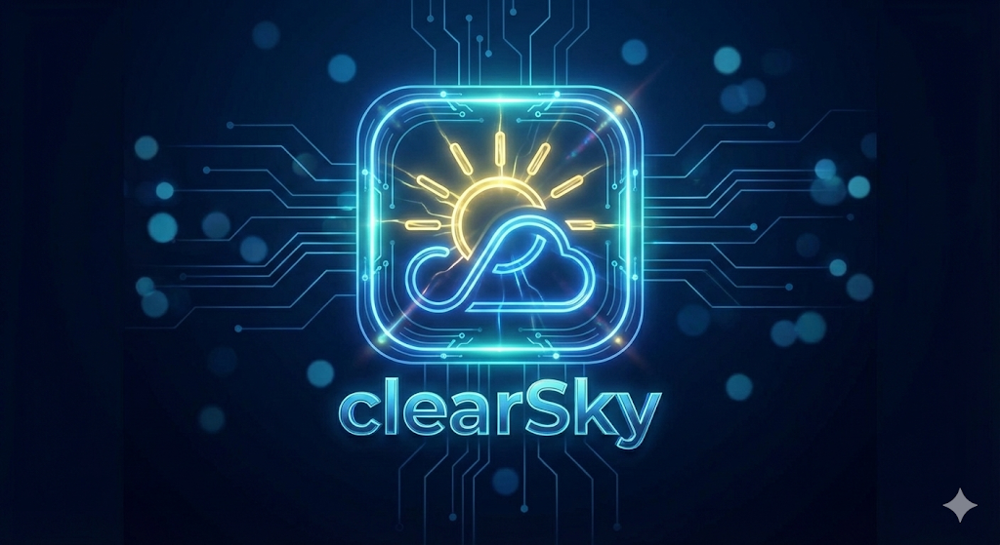
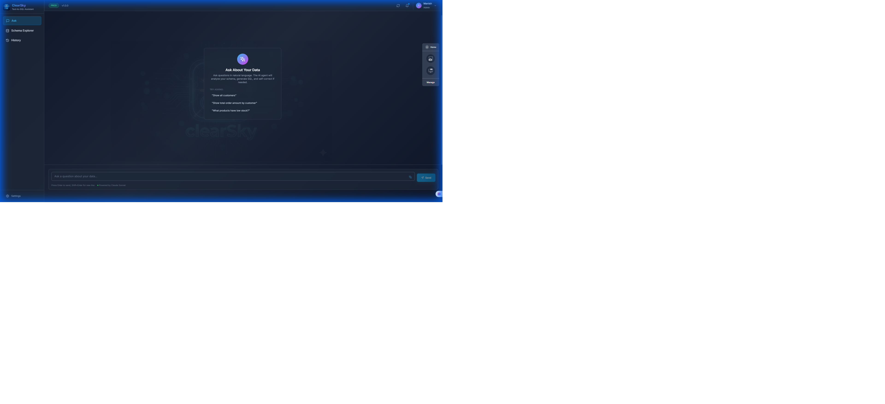
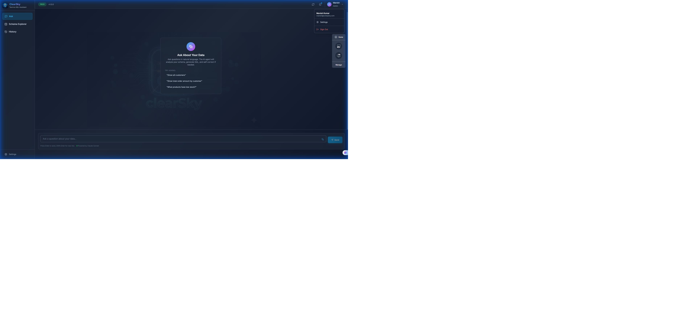
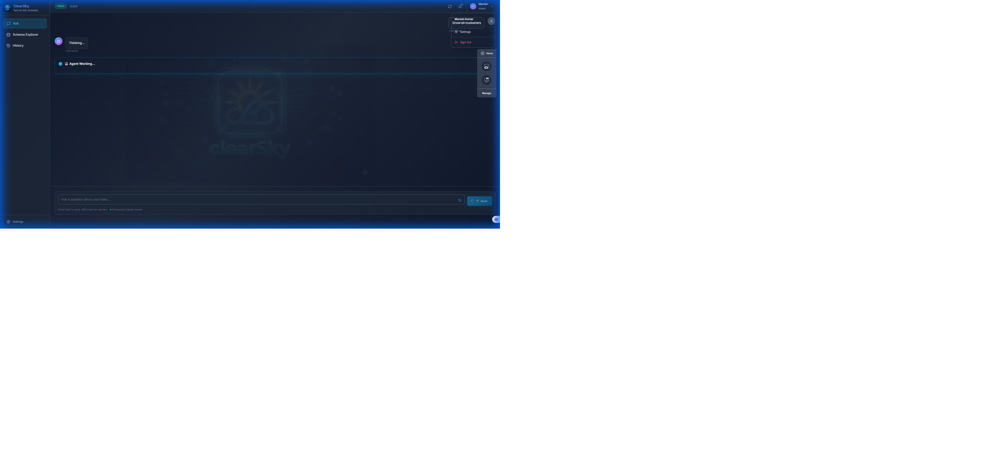
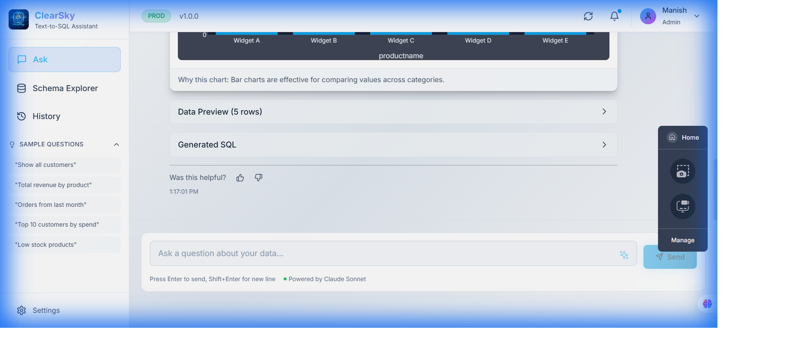
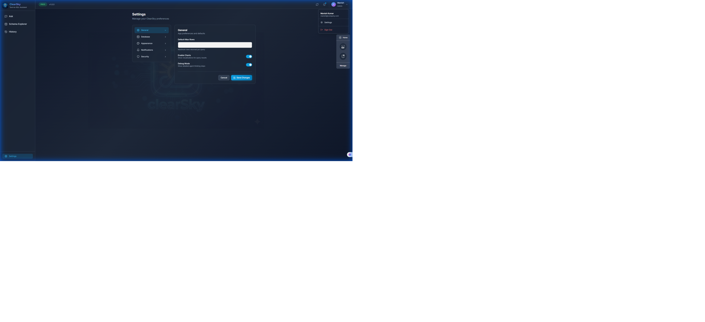
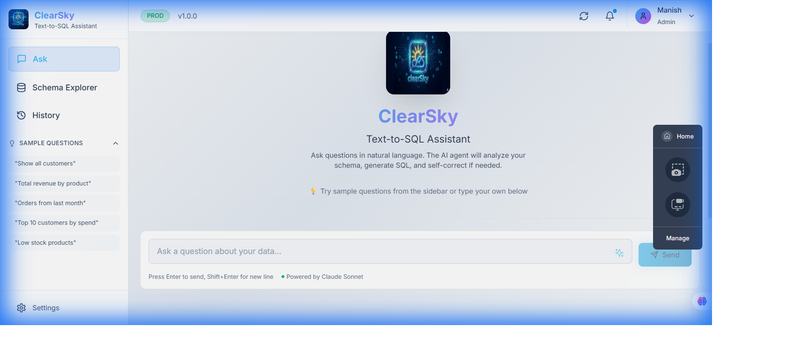
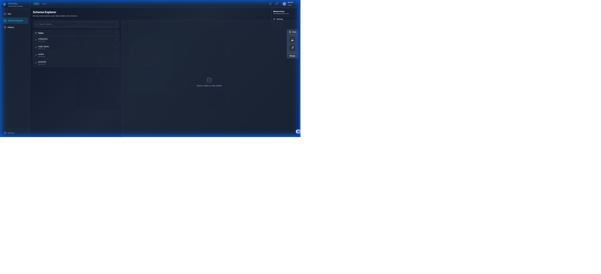
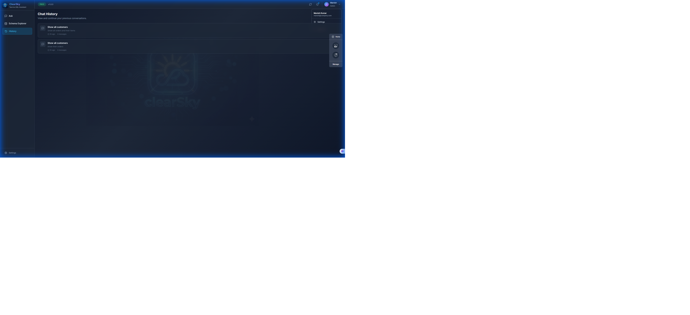
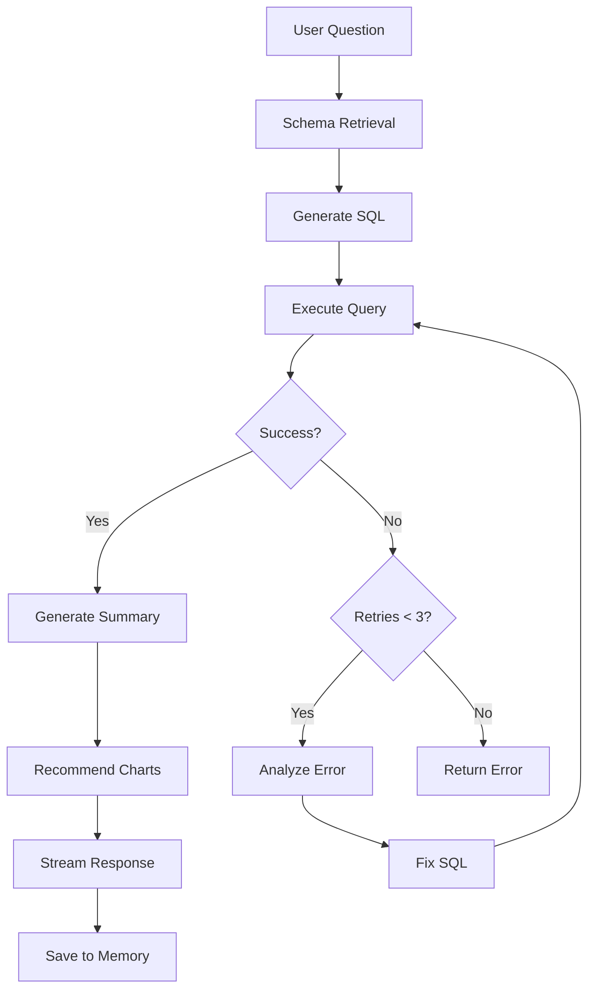

<div align="center">



# ClearSky Text-to-SQL Chatbot

**Transform natural language questions into SQL queries with AI-powered intelligence**

[](https://python.org)
[](https://reactjs.org)
[](https://typescriptlang.org)
[](https://aws.amazon.com)
[](LICENSE)

[Features](#-features) • [Demo](#-demo) • [Architecture](#-architecture) • [Quick Start](#-quick-start) • [Documentation](#-documentation)

</div>

---

## 🌟 Features

### 🤖 AI-Powered SQL Generation
- **Natural Language Understanding**: Ask questions in plain English, get precise SQL queries
- **Self-Correcting Agent**: Automatically fixes SQL errors and retries (up to 3 attempts)
- **Context-Aware**: Uses vector search to find relevant schema information

### 💾 Session Memory
- **Conversation Context**: Remembers previous questions in the same session
- **Smart References**: Understands "those customers" or "that data" from prior queries
- **Composable Memory**: Last 5 Q&A pairs used for context

### 📊 Rich Visualizations
- **Auto-Generated Charts**: Bar, line, pie charts based on data patterns
- **Chart Recommendations**: AI suggests the best visualization for your data
- **Data Tables**: Beautiful, responsive data tables with sorting

### ⚡ Real-Time Streaming
- **Live Thinking Process**: Watch the AI work step-by-step
- **SSE Streaming**: Server-Sent Events for real-time updates
- **Transparent Processing**: See schema retrieval, SQL generation, execution

---

## 🎬 Demo

### Landing Page
*The modern, dark-themed chat interface with example questions*



---

### User Profile Dropdown
*Access settings and user account options*



---

### Agent Thinking Process

When you ask a question, watch the AI agent think in real-time:

**1️⃣ Starting & Schema Retrieval**
*Agent identifies relevant tables from vector store*



**2️⃣ SQL Generation & Execution**
*Agent generates SQL and executes against Athena*


---

### Final Results with Summary
*Complete response with data table, summary, and chart recommendations*



---

### Session Memory in Action
*Follow-up query "show their orders" understands context from previous question*


---

### Settings Page
*Configure app preferences, database connections, and appearance*



---

### Light Theme Support
*Fully adaptive UI with system preference detection*



---

### Schema Explorer
*Browse database schema with table and column details*



---

### Query History
*View and replay past conversations*



---

## 🏗️ Architecture

```
┌─────────────────────────────────────────────────────────────────┐
│                         Frontend (React)                        │
│  ┌─────────┐  ┌──────────┐  ┌─────────┐  ┌─────────────────┐   │
│  │   Chat  │  │  Schema  │  │ History │  │    Settings     │   │
│  │Interface│  │ Explorer │  │  Page   │  │      Page       │   │
│  └────┬────┘  └────┬─────┘  └────┬────┘  └────────┬────────┘   │
│       └────────────┴─────────────┴────────────────┘             │
│                           │ SSE Streaming                       │
└───────────────────────────┼─────────────────────────────────────┘
                            │
┌───────────────────────────┼─────────────────────────────────────┐
│                    Backend (FastAPI)                            │
│  ┌────────────────────────┴────────────────────────────────┐   │
│  │                   Text-to-SQL Agent                      │   │
│  │  ┌──────────┐  ┌──────────┐  ┌──────────┐  ┌─────────┐  │   │
│  │  │  Schema  │  │   SQL    │  │  Query   │  │  Self   │  │   │
│  │  │ Resolver │──│Generator │──│ Executor │──│ Correct │  │   │
│  │  └────┬─────┘  └────┬─────┘  └────┬─────┘  └─────────┘  │   │
│  │       │              │              │                    │   │
│  └───────┼──────────────┼──────────────┼────────────────────┘   │
│          │              │              │                        │
│  ┌───────▼───────┐  ┌───▼────┐  ┌──────▼───────┐               │
│  │ FAISS Vector  │  │Bedrock │  │    Athena    │               │
│  │    Store      │  │  LLM   │  │   Service    │               │
│  └───────────────┘  └────────┘  └──────────────┘               │
└─────────────────────────────────────────────────────────────────┘
```

### Key Components

| Component | Technology | Purpose |
|-----------|------------|---------|
| **Frontend** | React 18, TypeScript, TailwindCSS | Modern responsive UI |
| **Backend** | FastAPI, Python 3.9+ | API server with SSE streaming |
| **LLM** | AWS Bedrock (Claude 3) | SQL generation & summarization |
| **Database** | AWS Athena | Query execution |
| **Vector Store** | FAISS (local) / OpenSearch (prod) | Schema context retrieval |
| **Embeddings** | AWS Bedrock Titan | Text to vector conversion |

---

## 🚀 Quick Start

### Prerequisites

- Python 3.9+
- Node.js 18+
- AWS Account with Bedrock and Athena access
- AWS credentials configured

### Installation

```bash
# Clone repository
git clone https://github.com/manish6007/clearskychatbot.git
cd clearskychatbot

# Backend setup
cd backend
pip install -r requirements.txt

# Frontend setup
cd ../frontend
npm install
```

### Local Development

```bash
# Terminal 1: Start backend
cd backend
$env:USE_LOCAL_CONFIG="true"  # PowerShell
python -m uvicorn app.main:app --host 127.0.0.1 --port 8000 --reload

# Terminal 2: Start frontend
cd frontend
npm run dev
```

Visit **http://localhost:5173** to start chatting!

---

## 💬 Example Questions

| Question Type | Example |
|---------------|---------|
| **Simple Query** | "Show all customers" |
| **Aggregation** | "What is the total revenue by product category?" |
| **Filtering** | "Show orders from last month" |
| **Joins** | "Show all orders with their items and product names" |
| **Follow-up** | "Show their email addresses" (uses session memory) |
| **Analytics** | "Which customers have the highest order value?" |

---

## 🔧 Configuration

### Environment Variables

```bash
# AWS Configuration
AWS_REGION=us-east-1
AWS_ACCESS_KEY_ID=your_key
AWS_SECRET_ACCESS_KEY=your_secret

# Local Development
USE_LOCAL_CONFIG=true
LOCAL_CONFIG_PATH=./local_setup/local_config.json
```

### Local Config (`local_config.json`)

```json
{
  "version": "1.0.0",
  "bedrock": {
    "model_id": "anthropic.claude-3-sonnet-20240229-v1:0",
    "embedding_model_id": "amazon.titan-embed-text-v1"
  },
  "athena": {
    "database": "athena_db",
    "workgroup": "primary",
    "output_location": "s3://your-bucket/athena-results/"
  }
}
```

---

## 📁 Project Structure

```
clearskychatbot/
├── backend/
│   ├── app/
│   │   ├── agents/           # Text-to-SQL agent with memory
│   │   ├── api/              # FastAPI endpoints
│   │   ├── knowledge/        # Schema resolver
│   │   ├── models/           # Pydantic models
│   │   ├── services/         # AWS services (Bedrock, Athena)
│   │   └── utils/            # SQL utilities
│   └── requirements.txt
├── frontend/
│   ├── src/
│   │   ├── components/       # React components
│   │   │   ├── chat/         # Chat interface
│   │   │   ├── charts/       # Visualization
│   │   │   └── layout/       # App layout
│   │   ├── hooks/            # Custom React hooks
│   │   ├── pages/            # Page components
│   │   └── api/              # API client
│   └── package.json
├── local_setup/
│   ├── schema_docs/          # Schema documentation
│   ├── build_vector_store.py # Vector store builder
│   └── local_config.json     # Local configuration
└── docs/
    └── screenshots/          # Demo screenshots
```

---

## 🎯 Agent Workflow



---

## 🔒 Security

- AWS IAM authentication for all services
- No SQL injection: queries are validated and sanitized
- Read-only Athena queries (no INSERT/UPDATE/DELETE)
- Session-based memory (no persistent storage of conversations)

---

## 📄 License

This project is licensed under the MIT License - see the [LICENSE](LICENSE) file for details.

---

## 🙏 Acknowledgments

- [AWS Bedrock](https://aws.amazon.com/bedrock/) for Claude 3 LLM
- [AWS Athena](https://aws.amazon.com/athena/) for serverless SQL
- [LlamaIndex](https://www.llamaindex.ai/) for RAG components
- [React](https://reactjs.org/) and [Vite](https://vitejs.dev/) for frontend

---

<div align="center">

**Built with ❤️ by [Manish Shrivastava](https://github.com/manish6007)**

⭐ Star this repo if you find it useful!

</div>
