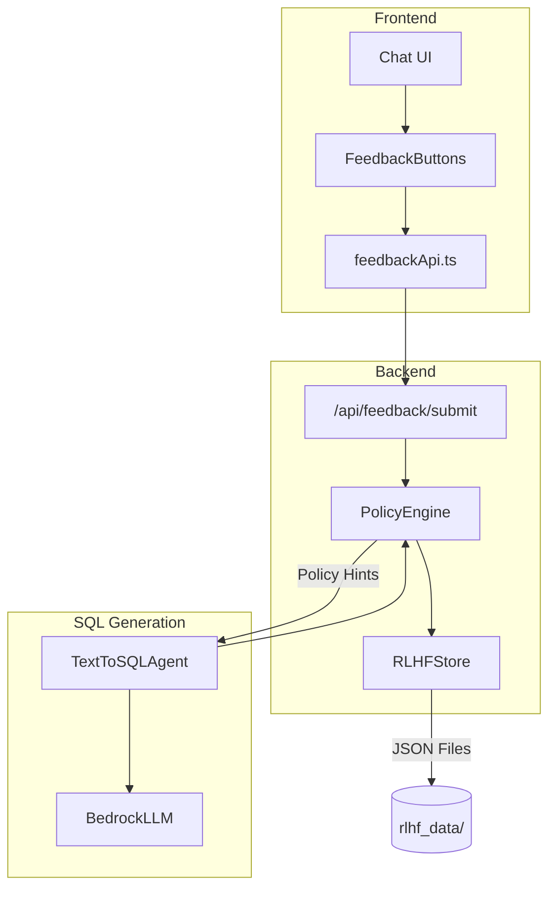

# How RLHF Works in ClearSky

This document explains how Reinforcement Learning from Human Feedback (RLHF) is implemented in the ClearSky Text-to-SQL chatbot.

## Overview

This is a **policy-driven RLHF system** that improves SQL generation without fine-tuning the LLM. Instead of modifying model weights, we modify the prompts sent to the LLM based on accumulated user feedback.

## Architecture



## The RLHF Flow

### Step 1: Feedback Collection

When a user clicks 👍 or 👎 on a query result:

```
User clicks 👍/👎 → Frontend sends feedback → PolicyEngine.record_feedback 
                 → Extract SQL patterns & tables → Store in JSON file
```

The `PolicyEngine` extracts metadata from the query:
- **Tables used** (e.g., `products`, `orders`)
- **SQL patterns** (e.g., `JOIN`, `GROUP BY`, `COUNT`)
- **Question/SQL pair**

### Step 2: Policy Evolution

After collecting feedback, the engine analyzes patterns and generates policy hints:

| Feedback Type | Threshold | Generated Hint |
|---------------|-----------|----------------|
| 👎 on table | 2+ times | `CAUTION: Be careful with [table] table` |
| 👎 on pattern | 3+ times | `AVOID: [pattern] often causes issues` |
| 👍 on pattern | 2+ times | `PREFER: [pattern] works well` |

Example policy update logic:
```python
def _update_policies_from_feedback(self, record):
    if record.feedback_type == FeedbackType.THUMBS_DOWN:
        # If "JOIN with customers" gets 3+ thumbs_down
        # → Create hint: "CAUTION: JOIN with customers table often produces incorrect results"
        self.store.add_policy_hint(PolicyHint(
            hint_type="caution",
            description="JOIN with customers table often produces incorrect results",
            tables=["customers"]
        ))
    elif record.feedback_type == FeedbackType.THUMBS_UP:
        # Generate "prefer" hints for successful patterns
        self.store.add_policy_hint(PolicyHint(
            hint_type="prefer",
            description="Use COALESCE for nullable columns",
            pattern="COALESCE"
        ))
```

### Step 3: Prompt Injection

When generating new SQL queries, the `PolicyEngine` injects hints into the LLM prompt:

```python
def _generate_sql(self, question, schema_context, message_id, session_id, tables):
    # Get learned policy hints
    policy_hints = self.policy_engine.get_policy_hints(question, tables)
    hints_section = self.policy_engine.format_hints_for_prompt(policy_hints)
    
    prompt = f"""Given this database schema:
    {schema_context}
    
    {hints_section}  # ← INJECTED POLICY HINTS
    
    Generate SQL for: {question}
    """
```

The formatted hints appear in the prompt like:
```
BASED ON PREVIOUS USER FEEDBACK:
- ⚠️ CAUTION: JOIN with customers table often produces incorrect results
- ✓ PREFER: Use COALESCE for nullable price columns
- 💡 TIP: Consider adding WHERE clauses for large tables
```

## Data Storage

All feedback and policy data is stored in JSON files:

```
backend/rlhf_data/
├── feedback_records.json  # Raw feedback data
└── policy_state.json      # Generated policy hints
```

### feedback_records.json
```json
{
  "records": [
    {
      "id": "uuid",
      "message_id": "msg-123",
      "session_id": "sess-456",
      "question": "Show me all products",
      "sql": "SELECT * FROM products",
      "feedback_type": "thumbs_up",
      "timestamp": "2024-12-16T12:00:00Z",
      "metadata": {
        "tables": ["products"],
        "patterns": ["SELECT"]
      }
    }
  ]
}
```

### policy_state.json
```json
{
  "hints": [
    {
      "id": "uuid",
      "hint_type": "prefer",
      "description": "Use COALESCE for nullable columns",
      "weight": 0.85,
      "tables": ["products"],
      "source_feedback_count": 3
    }
  ]
}
```

## Key Design Decisions

| Aspect | Decision | Rationale |
|--------|----------|-----------|
| **No LLM Fine-tuning** | Modify prompts, not model weights | Cost-effective, no training infrastructure needed |
| **No RL Libraries** | Simple threshold-based policy updates | Easy to understand, debug, and maintain |
| **JSON Storage** | Local files with file locking | Simple, transparent, works offline |
| **Contextual Hints** | Filter by tables/patterns | Relevant hints only, not noise |
| **Immediate Effect** | No retraining delay | New queries immediately benefit |

## API Endpoints

| Endpoint | Method | Description |
|----------|--------|-------------|
| `/api/feedback/submit` | POST | Submit thumbs up/down feedback |
| `/api/feedback/stats` | GET | Get aggregated feedback statistics |
| `/api/feedback/policy-hints` | GET | View current active policy hints |
| `/api/feedback/analyze` | POST | Manually trigger policy recalculation |
| `/api/feedback/clear` | DELETE | Clear all feedback data (for testing) |

## Benefits

1. **Cost-Effective**: No expensive LLM fine-tuning or retraining
2. **Transparent**: All feedback and policies stored in readable JSON
3. **Immediate**: Changes take effect on the next query
4. **Reversible**: Easy to clear or modify policies
5. **Human-in-the-Loop**: Users directly influence system behavior

## Limitations

1. **Cold Start**: No hints until feedback is collected
2. **Threshold Sensitivity**: May need tuning for different use cases
3. **Context Window**: Very long hint lists could affect prompt quality

## Future Enhancements

- Weighted decay for older feedback
- More sophisticated pattern matching
- A/B testing of different hint strategies
- Analytics dashboard for feedback trends
